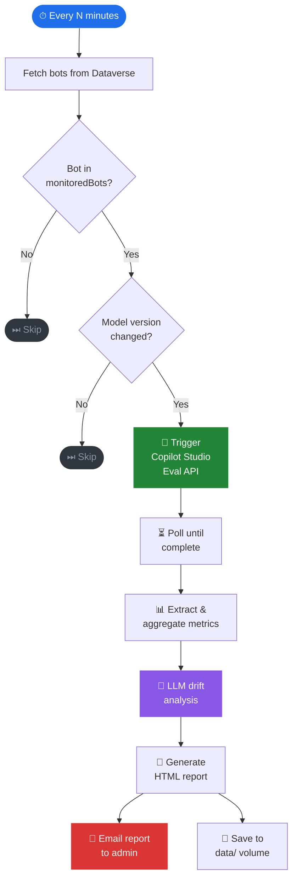
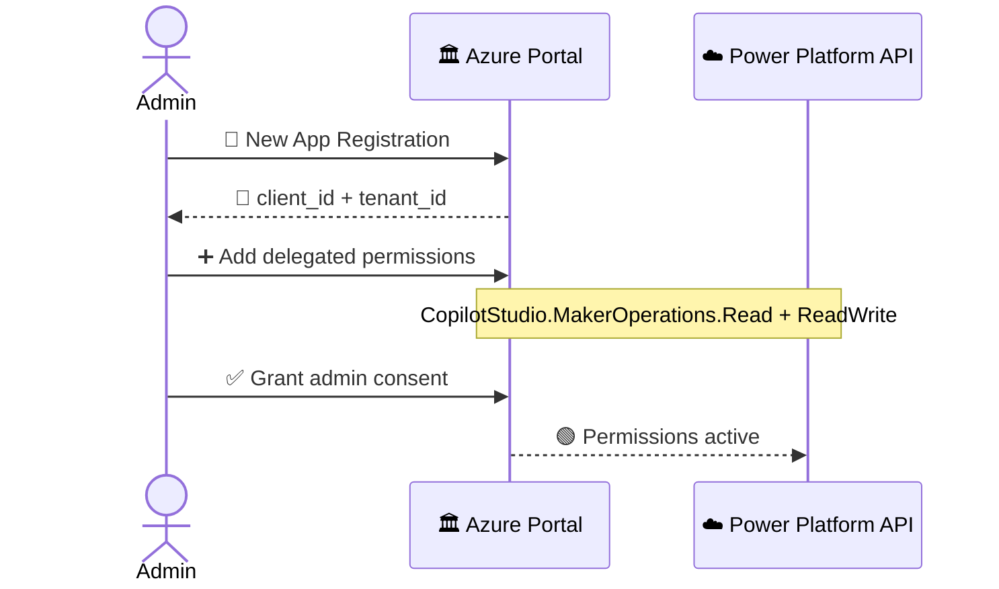
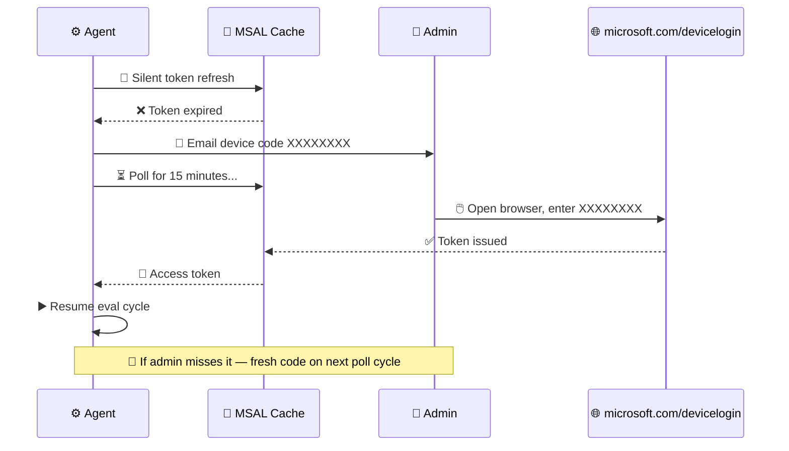

```
  ██╗     ██╗     ███╗   ███╗    ██████╗ ██████╗ ██╗███████╗████████╗
  ██║     ██║     ████╗ ████║    ██╔══██╗██╔══██╗██║██╔════╝╚══██╔══╝
  ██║     ██║     ██╔████╔██║    ██║  ██║██████╔╝██║█████╗     ██║
  ██║     ██║     ██║╚██╔╝██║    ██║  ██║██╔══██╗██║██╔══╝     ██║
  ███████╗███████╗██║ ╚═╝ ██║    ██████╔╝██║  ██║██║██║        ██║
  ╚══════╝╚══════╝╚═╝     ╚═╝    ╚═════╝ ╚═╝  ╚═╝╚═╝╚═╝        ╚═╝

  ⚡  T R A C K E R      copilot-eval-agent  ·  v1.0
```

<div align="center">


<br/>

### *Know the moment your AI changes — before your users do.*

<br/>

> 🤖 **Autonomous model drift detection for Microsoft Copilot Studio bots.**
> Watches every configured bot across all your Power Platform environments.
> Detects model version changes. Triggers evaluations. Emails you a
> side-by-side drift analysis report. Fully headless after first setup.

</div>

---

## ⚡ The Problem

🔕 Your Copilot Studio bots run on top of large language models. Microsoft updates those models silently. When they do, your bot's behaviour shifts — subtly or dramatically — with zero warning. Accuracy drops. Tone changes. Topics misfire. **You find out from a support ticket, not a dashboard.**

## 🎯 The Solution

🛡️ LLM Drift Tracker watches every bot you care about, around the clock. The moment a model version change is detected in Dataverse, it fires the Copilot Studio Eval API, pulls the results, runs an LLM analysis of the metric delta, and emails you a clean side-by-side report — all before your users notice anything.

> 🚫 No pass/fail verdicts &nbsp;·&nbsp; 🚫 No automated rollbacks &nbsp;·&nbsp; 🚫 No changes to your bots &nbsp;·&nbsp; 👁️ Pure, unobtrusive observation

---

## 🔄 How it works



---

## 🏗️ Architecture

```
  ╔══════════════════════════════════════════════════════════════════════╗
  ║  🖥️  HOST  (one-time setup)                                         ║
  ║                                                                      ║
  ║   drift setup ─────────────────────────── writes ──► 📄 config.json ║
  ║                └─────────────────────────── caches ► 🔑 msal_token  ║
  ╚══════════════════════╤═══════════════════════════════════════════════╝
                         │  📦 volume mount
                         ▼
  ╔══════════════════════════════════════════════════════════════════════╗
  ║  🐳  DOCKER  copilot-eval-agent                                     ║
  ║                                                                      ║
  ║   ⚙️  agent/main.py  ── 🔁 poll loop ───────────────────────────── ►║
  ║        │                                                             ║
  ║        ├──► 🌐 agent/dataverse.py  · monitoredBots filter ───────► ║─► 🗄️  Dataverse
  ║        │                                                             ║       bot entity
  ║        ├──► 🧪 agent/eval_client.py · trigger + poll ────────────► ║─► ☁️  Eval API
  ║        │                                                             ║       powerplatform.com
  ║        ├──► 🔐 agent/auth.py · MSAL silent refresh ──────────────► ║─► 🪪  Microsoft Identity
  ║        │                                                             ║       device code flow
  ║        ├──► 🧠 agent/reasoning.py · aiResultReason clustering ───► ║─► 🤖  LLM endpoint
  ║        │                                                             ║       (any OpenAI-compat)
  ║        ├──► 📧 agent/notifier.py · token expiry / report ready ──► ║─► 📬  SMTP → email
  ║        │                                                             ║
  ║        └──► 💾 agent/store.py ──────────────── writes ───────────► ║
  ║                                                                      ║
  ╚══════════════════════════════════════╤═════════════════════════════╤╝
                                         │                             │
                              ┌──────────▼──────────┐     ┌──────────▼──────────┐
                              │  💾  data/           │     │  📄  reports/       │
                              │  📍 tracking.json    │     │  report_*.html      │
                              │  📊 runs/<id>.json   │     │  📧 emailed + saved │
                              └──────────┬──────────┘     └─────────────────────┘
                                         │ 🔗 shared volume
                                         ▼
  ╔══════════════════════════════════════════════════════════════════════╗
  ║  📊  DASHBOARD  · 🌐 port 8501                                      ║
  ║                                                                      ║
  ║   📈 dashboard/app.py  ─── reads ──► 💾 data/                       ║
  ║                                                                      ║
  ║   🗺️ Fleet heatmap · 🕸️ Radar · 📈 Trend lines · 📦 Box plots       ║
  ║   🌊 Sankey · 📊 Failure clusters · 🧠 LLM analysis panel           ║
  ╚══════════════════════════════════════════════════════════════════════╝
```

---

## ✨ Features

| | Feature | Detail |
|---|---|---|
| 🌐 | **Multi-environment** | Watches bots across unlimited Power Platform environments |
| 📋 | **Opt-in per bot** | Select bots to monitor in `config.json` — no code changes ever |
| 🤖 | **Zero-touch eval** | Discovers test sets, triggers + polls the Eval API automatically |
| 📊 | **Side-by-side metrics** | Pass rate delta per metric — colour-coded, no pass/fail label |
| 🧠 | **LLM reasoning** | Any OpenAI-compatible model explains the drift in plain English |
| 🔄 | **Self-healing auth** | Token expires → emails admin a device code → resumes automatically |
| 📧 | **HTML reports** | Self-contained, email-ready, archived locally |
| 🐳 | **Docker native** | Fully headless, state mounted as volumes |
| 💾 | **No cloud storage** | All state is local JSON — no Dataverse writes, no blob storage |
| 📈 | **Streamlit dashboard** | Fleet heatmap · Radar · Trends · Sankey · Failure clusters |

---

## ⚡ CLI reference

After setup, everything runs through the `drift` command:

| Command | What it does |
|---|---|
| `drift setup` | Run the setup wizard — configure environments, bots, LLM, SMTP |
| `drift run` | Start the autonomous polling agent |
| `drift eval` | Force-run evals for all monitored bots right now (skips model-change check) |
| `drift dashboard` | Launch the Streamlit dashboard on `http://localhost:8501` |

---

## 🚀 Full setup — A to Z

### 🛒 Step 1 — Prerequisites

| ✅ | What | 🔗 How |
|---|---|---|
| 🐍 | Python 3.12+ | [python.org](https://python.org) |
| 🐳 | Docker Desktop | [docker.com](https://docker.com) |
| ☁️ | Azure CLI | `winget install Microsoft.AzureCLI` |
| 🔑 | Power Platform admin access | For app registration + admin consent |
| 🤖 | Copilot Studio Maker access | To create test sets |

---

### 🔑 Step 2 — App registration

🪪 The agent uses **delegated auth** — it calls the Eval API as you, not as a service. A Microsoft requirement for the Eval API.



1. 🌐 [portal.azure.com](https://portal.azure.com) → **Azure Active Directory** → **App registrations** → **New registration**
2. 📝 Name: `copilot-eval-agent` · Account type: **Single tenant** → **Register**
3. 📋 Note the **Application (client) ID** and **Directory (tenant) ID**
4. 🔐 **API permissions** → **Add a permission** → **APIs my organization uses** → search `Power Platform API`
5. ✅ **Delegated permissions** → tick `CopilotStudio.MakerOperations.Read` + `ReadWrite`
6. 🛡️ **Grant admin consent for [tenant]** → confirm

---

### 🧪 Step 3 — Create test sets in Copilot Studio

> ⚠️ The Eval API runs against test sets you define. Without them the agent skips the bot.

```
🤖 Copilot Studio → your bot → 📊 Evaluation tab → ➕ New test set
```

📝 Add 10–20 utterances covering the bot's main topics. The agent discovers and runs all test sets automatically.

---

### 🧙 Step 4 — Run the setup wizard

```bash
git clone https://github.com/kaul-vineet/LLMDriftTracker.git
cd LLMDriftTracker
pip install -r requirements.txt
drift setup
```

The wizard auto-discovers your Power Platform environments via the BAPI and lets you pick which bots to monitor — no manual IDs required.

| # | Step | 💬 What it does |
|---|---|---|
| 1️⃣ | 🌐 Environments | Discovers all environments from BAPI — pick which to include |
| 2️⃣ | 🤖 Bots | Lists all active bots per environment — pick which to monitor |
| 3️⃣ | 🔑 Credentials | Client ID · LLM endpoint + API key |
| 4️⃣ | ⚙️ Agent settings | Poll interval + eval timeouts |
| 5️⃣ | 🔐 Microsoft sign-in | Browser device code — one-time, token cached |
| 6️⃣ | 📧 SMTP | Mail server + test email (optional — skip to disable email) |

📦 Outputs: `config.json` + `msal_token_cache.json`

Re-run any individual step at any time:

```bash
drift setup
# → top-level menu lets you jump to any step
```

---

### 🗂️ Step 5 — config.json reference

The wizard writes this for you. Key fields:

```jsonc
{
  "environments": [
    {
      "name": "Contoso (default)",
      "orgUrl": "https://orgXXXXX.crm.dynamics.com",
      "environmentId": "Default-XXXXXXXX-...",
      "monitoredBots": [           // schema names of bots to watch
        "crf98_safeTravels",       // empty list = watch all active bots
        "crf98_hrAssistant"
      ]
    }
  ],

  "eval_app_client_id": "<client id>",   // 🔑 app registration
  "eval_app_tenant_id": "<tenant id>",   // 🏢 your tenant
  "token_cache_file": "msal_token_cache.json",

  "store_dir": "data",                   // 💾 local state directory
  "poll_interval_minutes": 20,           // ⏱️ how often to check

  "eval_poll_timeout_seconds": 1200,     // max wait for an eval run
  "eval_poll_interval_seconds": 20,      // how often to poll during eval

  "llm": {                               // 🧠 any OpenAI-compatible endpoint
    "base_url": "https://...",
    "api_key":  "",                      // set LLM_API_KEY env var or .env
    "model":    "gpt-4o"
  },

  "smtp": {                              // 📧 email reports (optional)
    "host":      "smtp.office365.com",
    "port":      587,
    "user":      "sender@contoso.com",
    "password":  "...",
    "recipient": "admin@contoso.com"
  }
}
```

**Secrets:** Store the LLM API key in a `.env` file (gitignored) — never in `config.json`:

```
LLM_API_KEY=your-key-here
```

**`monitoredBots`:** List bot schema names (e.g. `crf98_safeTravels`). Leave the list empty to monitor all active bots in that environment. To stop monitoring a bot, remove it from the list — takes effect on the next poll cycle.

🔀 SMTP values overridable via env vars: `SMTP_HOST` `SMTP_PORT` `SMTP_USER` `SMTP_PASSWORD` `SMTP_RECIPIENT`

---

### 🧑‍💻 Step 6 — Test locally

```bash
drift run
```

Expected output (GoT/LotR themed):
```
🧙  You shall not drift. Watching every 20 minute(s).

🌄  The Fellowship rides at dawn — 2026-04-18 14:30 UTC
📋  Contoso (default): 2 agent(s) answering the call (monitoredBots).
🏰  Safe Travels And Times: holds its post. No drift.
🌑  HR Assistant: darkness gathers — model drift detected: gpt-4o-2024-08-06 → gpt-4o-2024-11-20
⚔   HR Assistant: trial by combat begins — 'Evaluate HR Assistant'
   📜  [████████████░░░░░░] 240s/1200s  running  10 cases  run=398aa1df
⚔   HR Assistant: the verdict is reached.
📜  The scroll is sealed → data/report_20260418T143012.html
🦅  The raven flies to admin@contoso.com.
⚔  The watch is complete. 1 matter(s) brought before the Small Council.
```

**Force-run evals now** (skips model-change check — useful for testing or baseline collection):
```bash
drift eval
```

---

### 🐳 Step 7 — Run in Docker

🔨 **Build:**
```bash
docker build -t copilot-eval-agent .
```

🧑‍💻 **Agent — local auth (dev/test):**
```bash
docker run -d \
  -v $(pwd)/data:/app/data \
  -v $(pwd)/msal_token_cache.json:/app/msal_token_cache.json \
  -v $(pwd)/config.json:/app/config.json \
  copilot-eval-agent
```

🏭 **Agent — service principal auth (production):**
```bash
docker run -d \
  -e AZURE_TENANT_ID=<tenant-id> \
  -e AZURE_CLIENT_ID=<sp-client-id> \
  -e AZURE_CLIENT_SECRET=<sp-secret> \
  -e LLM_API_KEY=<llm-key> \
  -e SMTP_PASSWORD=<smtp-password> \
  -v $(pwd)/data:/app/data \
  -v $(pwd)/msal_token_cache.json:/app/msal_token_cache.json \
  -v $(pwd)/config.json:/app/config.json \
  copilot-eval-agent
```

📊 **Dashboard:**
```bash
docker run -d -p 8501:8501 \
  -v $(pwd)/data:/app/data \
  -v $(pwd)/config.json:/app/config.json \
  --entrypoint streamlit \
  copilot-eval-agent run dashboard/app.py --server.headless true
```

🌐 Open `http://localhost:8501`

📜 Watch logs:
```bash
docker logs -f <container-id>
```

---

## 🔐 Token expiry — self-healing



---

## 📊 Dashboard

```
┌──────────────────────────────────────────────────────────────────┐
│  ⚡ LLM DRIFT TRACKER        🟢 LIVE    🕐 last scan: 2 min ago  │
├──────────────┬───────────────┬────────────────┬──────────────────┤
│  🤖 4 Bots   │  🧪 12 Runs   │  ⚠️ 3 Drifts   │  🕐 Apr 18 14:30 │
│  Monitored   │  Total        │  Detected      │  Last Activity   │
└──────────────┴───────────────┴────────────────┴──────────────────┘
```

| 📈 Visual | 💡 What it shows |
|---|---|
| 🗺️ Fleet heatmap | All bots × all model versions — composite score per cell |
| 🕸️ Radar chart | Two models overlaid — metric-by-metric shape comparison |
| 📈 Trend lines | Metric trajectory across every model version |
| 📦 Box plots | Score distribution — consistency vs variance per model |
| 🌊 Sankey diagram | Test cases flowing pass→fail or fail→pass between models |
| 📊 Failure clusters | `aiResultReason` grouped by pattern — routing · formatting · safety |
| 🧠 LLM analysis | Plain-English drift narrative per bot |

---

## 📁 Directory structure

```
LLMDriftTracker/
│
├── 🤖 agent/                    ← core engine (Python package)
│   ├── __init__.py
│   ├── ⚙️  main.py              ← main loop — polls, orchestrates, saves reports
│   ├── 🧙 wizard.py             ← setup wizard (run via: drift setup)
│   ├── 🎭 lore.py               ← themed status output (GoT + LotR)
│   ├── 🔐 auth.py               ← dual-mode auth (az CLI locally · SP in Docker)
│   │                               self-healing eval token with email alert
│   ├── 🌐 dataverse.py          ← fetches monitored bots + model versions
│   ├── 🧪 eval_client.py        ← Copilot Studio Eval REST API
│   ├── 🧠 reasoning.py          ← metric aggregation + LLM drift narrative
│   ├── 📄 report.py             ← self-contained HTML report generator
│   ├── 📧 notifier.py           ← SMTP email sender (env var overrides)
│   └── 💾 store.py              ← local JSON state per bot
│
├── 📊 dashboard/                ← Streamlit read-only UI
│   ├── __init__.py
│   └── 📈 app.py                ← fleet heatmap · radar · trends · analysis
│
├── ⚡ drift                      ← CLI entry point (bash)
├── ⚡ drift.bat                  ← CLI entry point (Windows)
├── 🎨 .streamlit/
│   └── config.toml              ← dark theme config
├── 🐳 Dockerfile
├── 🚫 .dockerignore
├── 📦 requirements.txt
│
├── 📄 config.json               ← your config (tracked in git — LLM key in .env)
├── 🔑 msal_token_cache.json     ← cached auth token (gitignored — mount into Docker)
│
└── 💾 data/                     ← runtime state (mount into Docker)
    └── <botId>/
        ├── 📍 tracking.json     last known model version + run ID
        └── runs/
            └── 📊 <runId>.json  eval result + LLM analysis
```

---

## 🔑 Auth reference

| 🌍 Context | 🗄️ Dataverse / BAPI | 🧪 Eval API |
|---|---|---|
| 🖥️ Local (dev) | `az account get-access-token` | 🔐 MSAL device code → cached |
| 🐳 Docker (prod) | `ClientSecretCredential` via env vars | 🔑 Cached token, volume-mounted |

---

## 🔄 Continuity across machines

`config.json` and `data/` are committed to your (private) git repo so the agent resumes from any machine:

```bash
git clone <your-repo>
pip install -r requirements.txt
drift setup   # step 5 only — re-authenticate (MSAL token is device-bound)
drift run
```

The LLM API key is kept out of git — store it in `.env` on each machine.

---

## 🩺 Troubleshooting

| 🚨 Symptom | 🔧 Fix |
|---|---|
| `0 agent(s) found` | Check `monitoredBots` in `config.json` — run `drift setup` to re-pick bots |
| `no test sets found` | 🧪 Create a test set — Copilot Studio → bot → Evaluation tab |
| `no drift detected` | Run `drift eval` to force evals regardless of model change |
| `Dataverse token failed` | ☁️ Run `az login` |
| `MSAL auth failed` | 🧙 Re-run `drift setup` (step 5 — Microsoft sign-in) |
| `SMTP test failed` | 📧 Check credentials — Office 365 uses `smtp.office365.com:587` |
| Container exits immediately | 🐳 Run `docker logs <id>` — likely a missing volume mount |

---

<div align="center">

```
  ✦  ·  ★   ·  ✦   ·   ★  ·   ✦  ·  ★   ·  ✦
    ★   ✦  ·   ★  ✶   ·   ✦    ★   ·   ✸  ✦
  ·  ✦   ·  ✸  ·   ✦   ★   ·  ✶   ✦  ·  ★  ·
```

🐍 Python &nbsp;·&nbsp; 🔐 MSAL &nbsp;·&nbsp; ☁️ Copilot Studio Eval API &nbsp;·&nbsp; 🗄️ Dataverse Web API &nbsp;·&nbsp; 📊 Streamlit

*🏷️ Configure it. 😴 Forget it. ⚡ Know when things change.*

**[github.com/kaul-vineet/LLMDriftTracker](https://github.com/kaul-vineet/LLMDriftTracker)**

</div>
