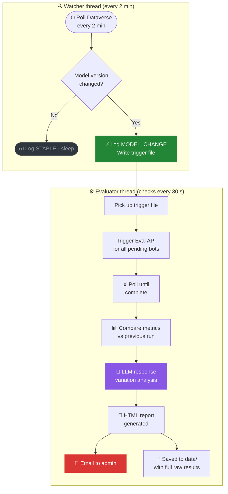

```
                    █████╗ ███████╗██╗  ██╗ ██████╗ ██╗  ██╗ █████╗
                   ██╔══██╗██╔════╝██║  ██║██╔═══██╗██║ ██╔╝██╔══██╗
                   ███████║███████╗███████║██║   ██║█████╔╝ ███████║
                   ██╔══██║╚════██║██╔══██║██║   ██║██╔═██╗ ██╔══██║
                   ██║  ██║███████║██║  ██║╚██████╔╝██║  ██╗██║  ██║
                   ╚═╝  ╚═╝╚══════╝╚═╝  ╚═╝ ╚═════╝ ╚═╝  ╚═╝╚═╝  ╚═╝

                   ⚡  VARION  ·  THE INCORRUPTIBLE JUDGE  ·  v1.1
```

<div align="center">


<br/>

### *Know the moment your AI changes — before your users do.*

<br/>

> **Autonomous model-swap detection and response variation assessment for Microsoft Copilot Studio bots.**
> Watches every configured bot across all your Power Platform environments.
> The moment a model version changes, it evaluates, analyses, and reports —
> fully headless, after a one-time browser setup.

</div>

---

## ⚡ The Problem

Microsoft updates the large language models powering your Copilot Studio bots **silently and without notice**. When a model is swapped, your bot's behaviour changes — accuracy drops, tone shifts, topics misfire. You have no visibility. You find out from a support ticket, not a dashboard.

## 🎯 The Solution

VARION runs a persistent background agent called **ASHOKA** that watches every bot you care about, around the clock. The moment a model version change is detected in Dataverse, ASHOKA fires the Copilot Studio Eval API, scores every test case, compares the results against the last known-good run, runs an LLM analysis of the delta, and emails you a clean side-by-side report — before your users notice anything.

---

## 🧭 Philosophy

> **ASHOKA observes. Humans decide.**

ASHOKA is a pure observer. It has no ability to roll back a model, modify a bot, or take any corrective action. Its only job is to surface the truth of what changed and when, with enough data for a human to make an informed decision.

This is deliberate. Automated rollbacks of AI systems carry their own risks. VARION gives your team the signal about what changed and by how much — the decision is always yours.

- 🚫 No pass/fail verdicts that auto-trigger action
- 🚫 No automated rollbacks or model changes
- 🚫 No writes to Dataverse or Copilot Studio
- 🔭 Pure, unobtrusive observation and reporting

---

## 🔄 How it works

ASHOKA runs two independent threads inside one process. Detection never waits for evaluation to finish.



> The watcher detects a model change within 2 minutes regardless of whether the evaluator
> is busy running evals for other bots. A model change for bot 4 is never blocked behind
> a 20-minute eval cycle running for bots 1, 2, 3.

---

## 🏗️ Architecture

```
  ┌─────────────────────────────────────────────────────────────┐
  │  Browser Setup  (one time)                                   │
  │                                                              │
  │   http://localhost:8501 → Setup page                        │
  │        sign in · pick environments · pick bots · save       │
  │        writes ──► config.json   caches ──► msal_cache       │
  └──────────────────────────┬──────────────────────────────────┘
                             │  shared  data/  volume
                             ▼
  ┌─────────────────────────────────────────────────────────────┐
  │  ASHOKA  —  autonomous agent  (python -m agent.main)        │
  │                                                             │
  │  ┌─ Watcher thread (every 2 min) ──────────────────────┐   │
  │  │  dataverse.py   poll bot model versions             │───┼──► Dataverse
  │  │  → writes force_eval_{botId}.trigger on change      │   │
  │  └─────────────────────────────────────────────────────┘   │
  │                                                             │
  │  ┌─ Evaluator thread (checks every 30 s) ──────────────┐   │
  │  │  eval_client.py  trigger + poll Eval API            │───┼──► Copilot Studio Eval API
  │  │  reasoning.py    classify · response variation      │───┼──► LLM endpoint (OpenAI-compat)
  │  │  store.py        write run.json per eval run        │   │
  │  │  report.py       generate self-contained HTML       │   │
  │  │  notifier.py     email report via SMTP              │───┼──► email
  │  └─────────────────────────────────────────────────────┘   │
  │                                                             │
  │   auth.py        unified MSAL — one cache, three APIs      │──► Microsoft Identity
  │   events.py      append-only JSONL event log               │
  └──────────────────────────┬──────────────────────────────────┘
                             │
                    data/{botId}/runs/
                    {timestamp}_{modelVersion}/
                         run.json  ← full raw Eval API results
                    events.jsonl   ← every agent action
                    report_*.html  ← archived reports
                             │
  ┌──────────────────────────▼──────────────────────────────────┐
  │  Dashboard  —  Streamlit  (port 8501)                       │
  │                                                             │
  │   ASHOKA    fleet view · bot detail · run comparison       │
  │   Setup     browser-based config — no terminal needed      │
  │   Data      browse · delete runs, events, reports          │
  └─────────────────────────────────────────────────────────────┘
```

---

## ✨ Features

| | Feature | Detail |
|---|---|---|
| 🌐 | **Multi-environment** | Watches bots across unlimited Power Platform environments |
| 📋 | **Opt-in per bot** | Choose which bots to monitor — empty list = watch all active bots |
| 🤖 | **Zero-touch eval** | Discovers all test sets, triggers the Eval API, polls to completion automatically |
| 📊 | **Any-run comparison** | Compare any two historical runs — not just the latest pair |
| 🧠 | **LLM narrative** | Any OpenAI-compatible endpoint explains the response variation in plain English |
| 🔐 | **Unified MSAL auth** | Single token cache shared across Eval API, BAPI, and Dataverse |
| 📋 | **Event log** | Append-only `events.jsonl` — every agent action timestamped and queryable |
| ⚡ | **Force eval** | Trigger an eval now — globally or per-bot — without restarting the agent |
| 🧵 | **Non-blocking detection** | Watcher and evaluator run as separate threads — a model change is detected within 2 min even while a long eval cycle is running for other bots |
| ⚙️ | **Browser setup** | Full configuration in the dashboard — no terminal, no YAML editing |
| 📧 | **HTML reports** | Self-contained, email-ready, archived locally with full raw data |
| 🗄️ | **Data management** | Browse, inspect, and delete runs, events, and reports from the dashboard |
| 🐳 | **Docker Compose** | `docker compose up` starts agent + dashboard with a shared volume |
| 💾 | **No cloud storage** | All state is local JSON — no Dataverse writes, no blob storage |

---

## 🚀 Quick start

### Step 1 — Prerequisites

| | What | Notes |
|---|---|---|
| 🐍 | Python 3.12+ | [python.org](https://python.org) |
| 🔑 | Power Platform admin | For app registration + admin consent |
| 🤖 | Copilot Studio Maker | To create test sets on your bots |
| 🐳 | Docker Desktop | Optional — for containerised deployment |

### Step 2 — App registration

The agent uses **delegated auth** — it calls the Eval API as you, not as a service principal. This is a Microsoft requirement for the Eval API.

1. [portal.azure.com](https://portal.azure.com) → **Azure Active Directory** → **App registrations** → **New registration**
2. Name: `copilot-eval-agent` · Account type: **Single tenant** → **Register**
3. Note the **Application (client) ID** and **Directory (tenant) ID**
4. **API permissions** → **Add a permission** → **APIs my organization uses** → search `Power Platform API`
5. **Delegated permissions** → tick `CopilotStudio.MakerOperations.Read` + `ReadWrite`
6. **Grant admin consent for [tenant]** → confirm

### Step 3 — Create test sets

> Without test sets, ASHOKA has nothing to evaluate and will skip the bot.

```
Copilot Studio → your bot → Evaluation tab → New test set
```

Add 10–20 utterances covering your bot's main topics. ASHOKA discovers and runs all test sets automatically.

### Step 4 — Install

```bash
git clone https://github.com/kaul-vineet/LLMDriftTracker.git
cd LLMDriftTracker
pip install -r requirements.txt
```

Create `.env` for secrets:

```env
LLM_API_KEY=your-llm-key-here
SMTP_PASSWORD=your-smtp-password   # optional
```

### Step 5 — Configure via dashboard

```powershell
.\drift.bat dashboard        # Windows
./drift dashboard            # bash / Mac / Linux
```

Open `http://localhost:8501` → **Setup** page in the sidebar. Each section shows a ✓ or ✗ status. The sidebar shows **● READY** when all prerequisites are met.

| Section | What it configures |
|---|---|
| App Registration | Client ID + Tenant ID |
| Authentication | MSAL device flow — one-time browser sign-in, token cached |
| Environments | Discovers all Power Platform environments via BAPI |
| Bots | Lists active bots per environment — choose which to monitor |
| LLM Endpoint | Base URL + model — **Test** button validates live before saving |
| Notifications | SMTP config (optional) |

Click **Save config.json** when all sections show ✓.

### Step 6 — Start ASHOKA

Click **▶ Start Agent** in the sidebar (enabled only when ● READY). Or from the terminal:

```powershell
.\drift.bat run        # Windows
./drift run            # bash / Mac / Linux
```

Expected terminal output:
```
🧙  You shall not falter. Watching every 2 minute(s).

[watcher]  🌑  Safe Travels: darkness gathers — model change detected: gpt-4o → gpt-4o-mini
[watcher]  ⚔   HR Bot: a new sword is forged — gpt-4o → gpt-4o-mini

[evaluator] 🌄  The Fellowship rides at dawn — 2026-04-18 14:30 UTC
[evaluator] ⚔   Safe Travels: trial by combat begins
[evaluator] ⚔   HR Bot: trial by combat begins
[evaluator] ⚔   Safe Travels: the verdict is reached.
[evaluator] ⚔   HR Bot: the verdict is reached.
📜  The scroll is sealed → data/report_20260418T143012.html
🦅  The raven flies to admin@contoso.com.
```

The watcher logs model changes immediately as it finds them. The evaluator picks up all pending bots and runs them concurrently in one cycle.

---

## 🐳 Docker Compose

```bash
cp config.example.json config.json   # fill in your values, or use the Setup page
cp .env.example .env                 # add LLM_API_KEY

docker compose -f docker/docker-compose.yml up --build -d

docker compose -f docker/docker-compose.yml logs -f varion-agent
# open http://localhost:8501
```

Two containers, one image, shared `./data` volume:

| Container | Command | Port |
|---|---|---|
| `varion-agent` | `python -m agent.main` | — |
| `varion-dashboard` | `streamlit run dashboard/app.py` | 8501 |

---

## ☁️ Azure Container Apps (production)

1. `az acr build --registry <acr> --image varion .`
2. Deploy **two** Container Apps from the same image
3. Mount an **Azure Files share** at `/app/data` on both
4. Set secrets as env vars: `LLM_API_KEY`, `SMTP_PASSWORD`, etc.
5. Override the startup command per container (see `docker-compose.yml`)
6. Run Setup locally first to populate `msal_token_cache.json`, then upload it to the Azure Files share

---

## 📊 Dashboard pages

### ⚡ ASHOKA — Fleet · Detail · Timeline

The main view. ASHOKA is the agent's identity — named for the incorruptible Mauryan emperor who chose observation and restraint over aggression.

```
● SYSTEM ONLINE · ALL STABLE

        A S H O K A
     THE INCORRUPTIBLE JUDGE
  copilot-eval-agent · N agents monitored

[ MONITORED ]  [ EVAL RUNS ]  [ IMPROVED ]  [ REGRESSIONS ]  [ ALERT NOW ]

── MONITORED AGENTS ──────────────────────────────
  🟢 Safe Travels  gpt-4o  Apr 18 · 4 runs   →
  🔴 HR Bot        gpt-4o  Apr 17 · 2 runs   →

── WHO I AM ──────────────────────────────────────
  I am ASHOKA. I watch. I do not interfere.

── MISSION TIMELINE ──────────────────────────────
  Apr 18  ⚡ FORCE EVAL   Safe Travels  triggered by dashboard
  Apr 18  ✓ EVAL DONE    Safe Travels  pass 90%  avg 67.5  IMPROVED
  Apr 14  ✓ IMPROVED     Safe Travels  CompareMeaning.passRate
  Apr 10  ✗ REGRESSION   Safe Travels  CompareMeaning.passRate
  Apr 10  ⚠ MODEL SHIFT  Safe Travels  gpt-4o → gpt.default
```

Click any bot tile to open the **detail view**:

- **Run A / Run B** — select any two historical runs to compare
- **Radar chart** — both runs overlaid on a polar chart
- **Metric table** — Pass/Fail highlighted green/red, Δ column colour-coded
- **Per-metric breakdown** — delta bar, status grid, case-by-case results
- **Trend chart** — metric trajectory across all runs
- **▶ Force Eval** — queue an immediate eval for this bot only

### ⚙️ Setup — Browser configuration

Full configuration without touching the terminal. Writes `config.json`. The sidebar shows ● READY / ○ SETUP NOT COMPLETE with a bullet list of what's missing. The Start Agent button is gated on ● READY.

### 🗄️ Data — Storage management

Browse and clean up stored data. Two-click safety on all deletes.

- Per-run delete or bulk delete per bot
- Clear the event log
- Delete individual or all HTML reports
- Storage size summary at a glance

---

## 📋 Event log

Every agent action is appended to `data/events.jsonl`:

```jsonl
{"ts":"2026-04-18T14:14:32+00:00","event":"model_change","botName":"Safe Travels","detail":"gpt-4o → gpt.default"}
{"ts":"2026-04-18T14:14:35+00:00","event":"eval_start","botName":"Safe Travels","detail":"Eval triggered"}
{"ts":"2026-04-18T14:17:17+00:00","event":"eval_complete","botName":"Safe Travels","passRate":0.8,"avgScore":52.5,"verdict":"REGRESSED"}
{"ts":"2026-04-18T14:17:18+00:00","event":"regression","botName":"Safe Travels","detail":"CompareMeaning.passRate"}
```

| Event | When |
|---|---|
| `cycle_start` | Poll cycle begins |
| `model_change` | Model version shift detected in Dataverse |
| `eval_start` | Eval API call initiated |
| `eval_complete` | Eval finished — includes pass rate, avg score, verdict |
| `eval_timeout` | Eval polling timed out |
| `eval_no_sets` | No test sets found — bot skipped |
| `regression` | One or more metrics regressed |
| `improvement` | One or more metrics improved |
| `stable` | No change detected |
| `force_eval` | Triggered manually from dashboard or CLI |
| `error` | Unhandled exception |

---

## 💾 Storage layout

```
data/
├── events.jsonl                       ← append-only agent event log
├── agent.pid                          ← agent process ID (deleted on stop)
├── llm_status.json                    ← result of last LLM validation (Setup → Test)
├── force_eval.trigger                 ← drop to trigger all-bot eval immediately
├── force_eval_{botId}.trigger         ← written by watcher on model change; also written by dashboard Force Eval
├── eval_active_{botId}.lock           ← written by evaluator while a bot's eval is running; deleted on completion
│
└── {botId}/
    ├── tracking.json                  ← current model version + last run pointer
    └── runs/
        └── {timestamp}_{modelVersion}/
            └── run.json               ← full raw Eval API results for all test sets
```

All comparisons, classifications, and LLM analysis are computed fresh on demand. `run.json` stores only the raw Eval API output — nothing derived.

---

## 📁 Project structure

```
LLMDriftTracker/
│
├── agent/                    autonomous monitoring agent
│   ├── main.py               watcher thread · evaluator thread · PID management
│   ├── auth.py               unified MSAL — one cache for all three APIs
│   ├── dataverse.py          fetch bots + model versions from Dataverse
│   ├── eval_client.py        Copilot Studio Eval API — trigger + poll
│   ├── reasoning.py          metric extraction · classify · response variation analysis
│   ├── events.py             append-only JSONL event logger
│   ├── store.py              run storage — {timestamp}_{modelVersion}/run.json
│   ├── report.py             self-contained HTML report generator
│   ├── notifier.py           SMTP email sender
│   ├── wizard.py             terminal setup wizard (alternative to dashboard)
│   └── lore.py               GoT/LotR themed terminal output
│
├── dashboard/                Streamlit web UI
│   ├── app.py                entry point — router · sidebar · agent controls
│   ├── theme.py              colour palette + font constants
│   ├── spinner.py            full-screen loading overlay (hyperspace + orbit)
│   └── pages/
│       ├── ashoka.py         fleet · bot detail · run comparison · timeline
│       ├── setup.py          browser-based configuration form
│       └── data.py           storage browser and cleanup
│
├── scripts/                  dev utilities (not part of the app)
│   ├── gen_dummy_data.py     generate sample run data for testing
│   └── seed_events.py        seed the event log with sample events
│
├── config.example.json       template — copy to config.json and fill in
├── docker/
│   ├── Dockerfile
│   └── docker-compose.yml    two-service local stack
├── drift                     CLI entry point (bash / Mac / Linux)
├── drift.bat                 CLI entry point (Windows)
├── requirements.txt
└── .streamlit/config.toml   dark theme + server config
```

---

## ⚡ CLI reference

| Command (Windows) | Command (bash) | What it does |
|---|---|---|
| `.\drift.bat dashboard` | `./drift dashboard` | Launch dashboard on port 8501 |
| `.\drift.bat run` | `./drift run` | Start the autonomous agent |
| `.\drift.bat eval` | `./drift eval` | Force-run evals for all bots now |
| `.\drift.bat setup` | `./drift setup` | Terminal setup wizard (alternative to browser) |

---

## 🔐 Auth

All API calls (Eval API, BAPI, Dataverse) share one MSAL `PublicClientApplication` and one `SerializableTokenCache` file. Device flow runs once; all subsequent calls acquire silently via the cached refresh token.

| Scenario | Behaviour |
|---|---|
| First run | MSAL device code flow — browser sign-in, token cached |
| Subsequent runs | Silent refresh — no user interaction |
| Token expired | Agent emails admin a new device code, polls for 15 min |
| Docker / Azure | Mount `msal_token_cache.json` on the shared volume |

---

## 🩺 Troubleshooting

The watcher interval defaults to 120 seconds. To tune it, add `"watch_interval_seconds": 60` to `config.json`.

| Symptom | Fix |
|---|---|
| `0 bots found` | Check `monitoredBots` in `config.json` — or rerun Setup to re-pick |
| `no test sets found` | Create a test set in Copilot Studio → bot → Evaluation tab |
| Nothing in dashboard | Use **▶ Force Eval** on the bot detail page, or run `.\drift.bat eval` |
| LLM 401 error | Check `LLM_API_KEY` in `.env` — key must match the endpoint |
| `MSAL auth failed` | Re-authenticate via Setup → Authentication → Sign In |
| BAPI 401 on Load Environments | App registration needs admin consent for `service.powerapps.com` delegated scope |
| SMTP failed | Office 365: `smtp.office365.com:587` — password in `.env` as `SMTP_PASSWORD` |
| Container exits immediately | `docker compose logs varion-agent` — likely missing volume or env var |
| Timeline empty | Run a force eval — it will write the first events to `data/events.jsonl` |

---

<div align="center">

```
  ✦  ·  ★   ·  ✦   ·   ★  ·   ✦  ·  ★   ·  ✦
    ★   ✦  ·   ★  ✶   ·   ✦    ★   ·   ✸  ✦
  ·  ✦   ·  ✸  ·   ✦   ★   ·  ✶   ✦  ·  ★  ·
```

Python &nbsp;·&nbsp; MSAL &nbsp;·&nbsp; Copilot Studio Eval API &nbsp;·&nbsp; Dataverse &nbsp;·&nbsp; Streamlit

*Configure it. Forget it. Know when things change.*

**[github.com/kaul-vineet/LLMDriftTracker](https://github.com/kaul-vineet/LLMDriftTracker)**

</div>
