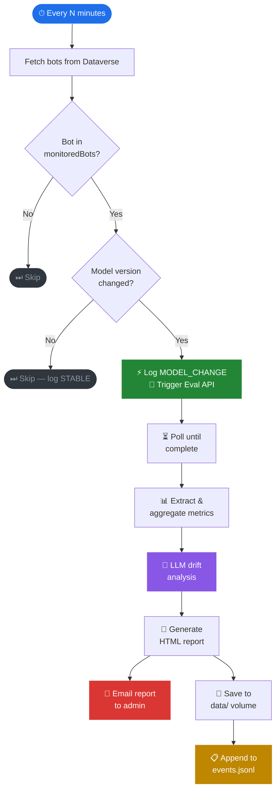

```
  ██╗     ██╗     ███╗   ███╗    ██████╗ ██████╗ ██╗███████╗████████╗
  ██║     ██║     ████╗ ████║    ██╔══██╗██╔══██╗██║██╔════╝╚══██╔══╝
  ██║     ██║     ██╔████╔██║    ██║  ██║██████╔╝██║█████╗     ██║
  ██║     ██║     ██║╚██╔╝██║    ██║  ██║██╔══██╗██║██╔══╝     ██║
  ███████╗███████╗██║ ╚═╝ ██║    ██████╔╝██║  ██║██║██║        ██║
  ╚══════╝╚══════╝╚═╝     ╚═╝    ╚═════╝ ╚═╝  ╚═╝╚═╝╚═╝        ╚═╝

  ⚡  T R A C K E R      copilot-eval-agent  ·  v1.1
```

<div align="center">


<br/>

### *Know the moment your AI changes — before your users do.*

<br/>

> 🤖 **Autonomous model drift detection for Microsoft Copilot Studio bots.**
> Watches every configured bot across all your Power Platform environments.
> Detects model version changes. Triggers evaluations. Emails you a
> side-by-side drift analysis report. Fully headless after first setup.

</div>

---

## ⚡ The Problem

🔕 Your Copilot Studio bots run on top of large language models. Microsoft updates those models silently. When they do, your bot's behaviour shifts — subtly or dramatically — with zero warning. Accuracy drops. Tone changes. Topics misfire. **You find out from a support ticket, not a dashboard.**

## 🎯 The Solution

🛡️ LLM Drift Tracker watches every bot you care about, around the clock. The moment a model version change is detected in Dataverse, it fires the Copilot Studio Eval API, pulls the results, runs an LLM analysis of the metric delta, and emails you a clean side-by-side report — all before your users notice anything.

> 🚫 No pass/fail verdicts &nbsp;·&nbsp; 🚫 No automated rollbacks &nbsp;·&nbsp; 🚫 No changes to your bots &nbsp;·&nbsp; 👁️ Pure, unobtrusive observation

---

## 🔄 How it works



---

## 🏗️ Architecture

```
  ╔══════════════════════════════════════════════════════════════════════╗
  ║  🖥️  HOST  (one-time setup)                                         ║
  ║                                                                      ║
  ║   .\drift.bat setup ────────────────────── writes ──► 📄 config.json ║
  ║                └─────────────────────────── caches ► 🔑 msal_cache  ║
  ╚══════════════════════╤═══════════════════════════════════════════════╝
                         │  📦 volume mount
                         ▼
  ╔══════════════════════════════════════════════════════════════════════╗
  ║  🐳  DOCKER  (docker compose up)                                    ║
  ║                                                                      ║
  ║   ⚙️  agent/main.py  ── 🔁 poll loop ───────────────────────────── ►║
  ║        │                                                             ║
  ║        ├──► 🌐 agent/dataverse.py  · monitoredBots filter ───────► ║─► 🗄️  Dataverse
  ║        │                                                             ║       bot entity
  ║        ├──► 🧪 agent/eval_client.py · trigger + poll ────────────► ║─► ☁️  Eval API
  ║        │                                                             ║       powerplatform.com
  ║        ├──► 🔐 agent/auth.py · unified MSAL (one cache, all APIs) ►║─► 🪪  Microsoft Identity
  ║        │                                                             ║       device code flow
  ║        ├──► 🧠 agent/reasoning.py · classify + LLM narrative ────► ║─► 🤖  LLM endpoint
  ║        │                                                             ║       (OpenAI-compat)
  ║        ├──► 📋 agent/events.py · append-only JSONL event log ────► ║
  ║        ├──► 📧 agent/notifier.py · SMTP HTML report ─────────────► ║─► 📬  email
  ║        └──► 💾 agent/store.py ──────────────── writes ───────────► ║
  ║                                                                      ║
  ╚══════════════════════════════════════╤═════════════════════════════╤╝
                                         │                             │
                              ┌──────────▼──────────┐     ┌──────────▼──────────┐
                              │  💾  data/           │     │  📄  reports/       │
                              │  📍 tracking.json    │     │  report_*.html      │
                              │  📋 events.jsonl     │     │  📧 emailed + saved │
                              │  runs/               │     └─────────────────────┘
                              │    {triggerGuid}/    │
                              │      meta.json       │
                              │      *.json          │
                              └──────────┬──────────┘
                                         │ 🔗 shared volume
                                         ▼
  ╔══════════════════════════════════════════════════════════════════════╗
  ║  📊  DASHBOARD  · 🌐 port 8501                                      ║
  ║                                                                      ║
  ║   📈 dashboard/app.py      ─── router · sidebar · agent controls   ║
  ║   ⚙️  dashboard/pages/     ─── multi-page Streamlit app             ║
  ║        ashoka.py           ─── fleet · detail · identity · timeline ║
  ║        1_Setup.py          ─── single-screen setup form             ║
  ║                                                                      ║
  ║   🕸️ Radar · 📈 Trend lines · 📊 Delta bars · 🧠 LLM analysis       ║
  ╚══════════════════════════════════════════════════════════════════════╝
```

---

## ✨ Features

| | Feature | Detail |
|---|---|---|
| 🌐 | **Multi-environment** | Watches bots across unlimited Power Platform environments |
| 📋 | **Opt-in per bot** | Select bots to monitor in `config.json` — no code changes ever |
| 🤖 | **Zero-touch eval** | Discovers test sets, triggers + polls the Eval API automatically |
| 📊 | **Any-run comparison** | Compare any two historical runs in the dashboard — not just the latest |
| 🧠 | **LLM reasoning** | Any OpenAI-compatible model explains the drift in plain English |
| 🔐 | **Unified MSAL auth** | Single token cache shared across Eval API, BAPI, and Dataverse |
| 📋 | **Mission event log** | Append-only `events.jsonl` records every agent action for the timeline |
| ⚡ | **Force-eval trigger** | File-based trigger — drop `force_eval.trigger` or run `.\drift.bat eval` |
| ⚙️ | **Single-screen setup** | Single-screen form in the dashboard — ✓/✗ section status, LLM validation, no CLI required |
| 🔄 | **Self-healing auth** | Token expires → emails admin device code → resumes automatically |
| 📧 | **HTML reports** | Self-contained, email-ready, archived locally |
| 🐳 | **Docker Compose** | `docker compose up` starts agent + dashboard with shared volume |
| 💾 | **No cloud storage** | All state is local JSON — no Dataverse writes, no blob storage |
| 👤 | **ASHOKA identity page** | Agent lore, WHO I AM bio, radar sweep animation, live mission timeline |

---

## ⚡ CLI reference

**Windows PowerShell:**

| Command | What it does |
|---|---|
| `.\drift.bat setup` | Run the terminal setup wizard |
| `.\drift.bat run` | Start the autonomous polling agent |
| `.\drift.bat eval` | Force-run evals for all monitored bots right now |
| `.\drift.bat dashboard` | Launch the Streamlit dashboard on `http://localhost:8501` |

**bash / Mac / Linux:**

| Command | What it does |
|---|---|
| `./drift setup` | Run the terminal setup wizard |
| `./drift run` | Start the autonomous polling agent |
| `./drift eval` | Force-run evals for all monitored bots right now |
| `./drift dashboard` | Launch the Streamlit dashboard on `http://localhost:8501` |

---

## 🚀 Full setup — A to Z

### 🛒 Step 1 — Prerequisites

| ✅ | What | 🔗 How |
|---|---|---|
| 🐍 | Python 3.12+ | [python.org](https://python.org) |
| 🐳 | Docker Desktop (optional) | [docker.com](https://docker.com) |
| 🔑 | Power Platform admin access | For app registration + admin consent |
| 🤖 | Copilot Studio Maker access | To create test sets |

---

### 🔑 Step 2 — App registration

🪪 The agent uses **delegated auth** — it calls the Eval API as you, not as a service. A Microsoft requirement for the Eval API.

1. 🌐 [portal.azure.com](https://portal.azure.com) → **Azure Active Directory** → **App registrations** → **New registration**
2. 📝 Name: `copilot-eval-agent` · Account type: **Single tenant** → **Register**
3. 📋 Note the **Application (client) ID** and **Directory (tenant) ID**
4. 🔐 **API permissions** → **Add a permission** → **APIs my organization uses** → search `Power Platform API`
5. ✅ **Delegated permissions** → tick `CopilotStudio.MakerOperations.Read` + `ReadWrite`
6. 🛡️ **Grant admin consent for [tenant]** → confirm

---

### 🧪 Step 3 — Create test sets in Copilot Studio

> ⚠️ The Eval API runs against test sets you define. Without them the agent skips the bot.

```
🤖 Copilot Studio → your bot → 📊 Evaluation tab → ➕ New test set
```

📝 Add 10–20 utterances covering the bot's main topics. The agent discovers and runs all test sets automatically.

---

### 🧙 Step 4 — Install and configure

```bash
git clone https://github.com/kaul-vineet/LLMDriftTracker.git
cd LLMDriftTracker
pip install -r requirements.txt
```

Create a `.env` file for secrets (never commit this):

```env
LLM_API_KEY=your-llm-key-here
SMTP_PASSWORD=your-smtp-password   # optional
```

The agent auto-loads `.env` on startup — no manual `set` or `export` needed.

**Option A — Terminal wizard:**
```powershell
# Windows
.\drift.bat setup

# bash / Mac / Linux
./drift setup
```

**Option B — Browser setup form:**
```powershell
# Windows
.\drift.bat dashboard

# bash / Mac / Linux
./drift dashboard
# → open http://localhost:8501 → sidebar → Setup page
```

The setup form auto-discovers your Power Platform environments via BAPI and lets you pick which bots to monitor. Each section shows a ✓ (green) or ✗ (red) status indicator — the sidebar shows **● READY** when all prerequisites are met:

| Section | What it does |
|---|---|
| App Registration | Client ID + Tenant ID |
| Authentication | MSAL device flow — one-time browser sign-in |
| Environments | Discovers all envs from BAPI — pick which to include |
| Bots | Lists active bots per env — pick which to monitor |
| LLM Endpoint | Endpoint + model — **Test** button validates with a live call, writes `data/llm_status.json` |
| Notifications | SMTP config (optional) |

> 💡 The **Start Agent** button in the sidebar stays disabled until the sidebar shows **● READY**.

---

### 🗂️ Step 5 — config.json reference

| Field | Description |
|---|---|
| `environments[].orgUrl` | Dataverse org URL, e.g. `https://orgXXXXX.crm.dynamics.com` |
| `environments[].monitoredBots` | Schema names of bots to watch — empty = all active bots |
| `eval_app_client_id` | App registration client ID |
| `eval_app_tenant_id` | Azure AD tenant ID |
| `token_cache_file` | MSAL token cache path — mount on shared volume in Docker |
| `store_dir` | Local directory for run history (`data/` by default) |
| `poll_interval_minutes` | How often the agent checks for model changes |
| `eval_poll_timeout_seconds` | Max wait for an eval run to complete (default 1200) |
| `llm.base_url` | Any OpenAI-compatible endpoint |
| `llm.api_key` | Leave blank — use `LLM_API_KEY` in `.env` |
| `llm.model` | Model name for drift analysis narration |
| `smtp.*` | Mail server config — all fields overridable via env vars |

**Env var overrides** (for Docker / Azure Container Apps):
```
LLM_API_KEY  LLM_BASE_URL  LLM_MODEL
SMTP_HOST  SMTP_PORT  SMTP_USER  SMTP_PASSWORD  SMTP_RECIPIENT
```

---

### 🧑‍💻 Step 6 — Test locally

```powershell
# Windows
.\drift.bat run

# bash / Mac / Linux
./drift run
```

Expected output (GoT/LotR themed):
```
🧙  You shall not drift. Watching every 20 minute(s).

🌄  The Fellowship rides at dawn — 2026-04-18 14:30 UTC
📋  Contoso (default): 1 agent(s) answering the call.
🌑  Safe Travels: darkness gathers — model drift detected: gpt-4o → gpt.default
⚔   Safe Travels: trial by combat begins — 'Evaluate Safe Travels'
   📜  240s  running  10 cases  run=398aa1df
⚔   Safe Travels: the verdict is reached.
📜  The scroll is sealed → data/report_20260418T143012.html
🦅  The raven flies to admin@contoso.com.
```

**Force-run evals now:**
```powershell
# Windows
.\drift.bat eval

# bash / Mac / Linux
./drift eval
```

**Or trigger from the dashboard** — the agent checks for `data/force_eval.trigger` every 60 seconds and runs immediately when it appears.

---

### 🐳 Step 7 — Docker Compose (recommended)

The simplest way to run both the agent and dashboard together:

```bash
# Copy secrets to environment
cp .env.example .env   # fill in LLM_API_KEY etc.

docker compose up --build -d

# Watch agent logs
docker compose logs -f drift-agent

# Open dashboard
open http://localhost:8501
```

`docker-compose.yml` starts two containers from the same image, sharing a `./data` volume:

| Container | Command | Port |
|---|---|---|
| `drift-agent` | `python -m agent.main` | — |
| `drift-dashboard` | `streamlit run dashboard/app.py` | 8501 |

---

### ☁️ Step 8 — Azure Container Apps (production)

1. Push image to ACR: `az acr build --registry <acr> --image llm-drift-tracker .`
2. Deploy **two** Container Apps from the same image
3. Mount an **Azure Files share** at `/app/data` on both — shared volume for run data and MSAL cache
4. Set secrets as environment variables (`LLM_API_KEY`, `SMTP_PASSWORD`, etc.)
5. Override command per container app (see `docker-compose.yml` for the exact commands)

Auth: run `.\drift.bat setup` (Windows) or `./drift setup` (bash) locally first so `msal_token_cache.json` is populated, then copy it to the Azure Files share.

---

## 📊 Dashboard

Two pages, accessible from the sidebar:

### ASHOKA — Fleet + Bot Detail + Identity + Timeline

```
● SYSTEM ONLINE · ALL STABLE          [radar sweep]

        A S H O K A
          THE INCORRUPTIBLE JUDGE
    copilot-eval-agent · N agents monitored

[ MONITORED ]  [ EVAL RUNS ]  [ IMPROVED ]  [ REGRESSIONS ]  [ ALERT NOW ]

── MONITORED AGENTS ──────────────────────────────────────
  🟢 Safe Travels   gpt-4o   Apr 18 · 4 runs   [click → detail]
  🔴 HR Bot         gpt-4o   Apr 17 · 2 runs   [click → detail]

── WHO I AM ──────────────────────────────────────────────
  I am ASHOKA — born February 16, 2026. I watch the models
  powering your Copilot Studio bots ...

── MISSION TIMELINE ──────────────────────────────────────
Apr 10   ⚠ model_change  Safe Travels  gpt-4o → gpt.default
Apr 10   ▶ eval_start    Safe Travels  Eval triggered
Apr 10   ✗ regression    Safe Travels  CompareMeaning.passRate
Apr 14   ✓ improvement   Safe Travels  pass 100%  avg 72.5
Apr 18   ⚡ force_eval                 Triggered by dashboard
...
                         CONCEIVED & BUILT BY
                            OUROBOROS · 2026
```

The timeline is driven by `data/events.jsonl` — every agent action is appended in real time. The 3 origin events (birth, first autonomous night, creator's return) are fixed; everything else is live from the file.

Click any bot tile to open the detail view:

- **Run A / Run B selectors** — compare any two historical runs
- **Radar** — polar chart; both runs overlaid as filled bars
- **Metric Summary** — compact comparison table
- **Per metric type** — delta bar, status transition grid, case-by-case table
- **Trend chart** — metric trajectory across all runs
- **Back to fleet** — top of page

### Setup — single-screen configuration form

Configure environments, bots, LLM endpoint, and SMTP without touching the terminal. Writes `config.json` directly. Each section displays a ✓ or ✗ status indicator. The sidebar shows **● READY** (green) when all five prerequisites are met; otherwise **○ SETUP NOT COMPLETE** with a bullet list of what's missing. The **Start Agent** button is disabled until the setup is complete.

---

## 📋 Event log — `data/events.jsonl`

Every agent action is recorded as a JSON line:

```jsonl
{"ts":"2026-04-18T14:14:32+00:00","event":"force_eval","detail":"force_eval.trigger detected"}
{"ts":"2026-04-18T14:14:35+00:00","event":"eval_start","botName":"Safe Travels","detail":"Eval triggered"}
{"ts":"2026-04-18T14:17:17+00:00","event":"eval_complete","botName":"Safe Travels","detail":"pass 80%  ·  avg 52.5  ·  REGRESSED","passRate":0.8,"avgScore":52.5}
{"ts":"2026-04-18T14:17:18+00:00","event":"regression","botName":"Safe Travels","detail":"Regression in: CompareMeaning.passRate"}
```

| Event | Logged when |
|---|---|
| `cycle_start` | Poll cycle begins (scheduled or forced) |
| `model_change` | Model version shift detected |
| `eval_start` | Eval API call initiated |
| `eval_complete` | Eval finished — includes pass rate, avg score, verdict |
| `eval_timeout` | Eval polling timed out |
| `eval_no_sets` | No active test sets found — bot skipped |
| `regression` | One or more metrics regressed vs previous run |
| `improvement` | One or more metrics improved |
| `stable` | No drift — model unchanged |
| `force_eval` | force_eval.trigger file detected |
| `error` | Unhandled exception during cycle |

---

## 💾 Storage layout

```
data/
├── events.jsonl                    ← append-only agent action log
├── agent.pid                       ← running agent PID (deleted on stop)
├── llm_status.json                 ← LLM validation result written by Setup → Test button
├── force_eval.trigger              ← created by dashboard to request immediate eval
│
└── {botId}/
    ├── tracking.json               ← last known model version + trigger GUID
    └── runs/
        └── {triggerGuid}/          ← one folder per eval trigger
            ├── meta.json           ← timestamp, model version, verdict, LLM analysis
            └── CompareMeaning.json ← full Eval API result for this metric type
```

Legacy flat-file runs (`{runId}_{ts}.json`) are detected and wrapped automatically for backward compatibility.

---

## 📁 Directory structure

```
LLMDriftTracker/
│
├── 🤖 agent/
│   ├── __init__.py
│   ├── ⚙️  main.py          ← poll loop, force-eval trigger, event logging
│   ├── 🧙 wizard.py         ← terminal setup wizard
│   ├── 🎭 lore.py           ← GoT/LotR themed terminal output
│   ├── 🔐 auth.py           ← unified MSAL (one cache for Eval + BAPI + Dataverse)
│   ├── 🌐 dataverse.py      ← fetches bots + model versions
│   ├── 🧪 eval_client.py    ← Copilot Studio Eval REST API
│   ├── 🧠 reasoning.py      ← metric extraction, classify_run, LLM narrative
│   ├── 📋 events.py         ← append-only JSONL event logger
│   ├── 📄 report.py         ← HTML report generator
│   ├── 📧 notifier.py       ← SMTP sender
│   └── 💾 store.py          ← folder-per-trigger run storage
│
├── 📊 dashboard/
│   ├── __init__.py
│   ├── 📈 app.py            ← fleet view · bot detail · run comparison
│   └── pages/
│       ├── ⚡ ashoka.py     ← fleet · bot detail · identity · mission timeline
│       └── ⚙️  1_Setup.py   ← single-screen setup form with ✓/✗ section status
│
├── 🐳 docker-compose.yml    ← two-service local stack
├── 🐳 Dockerfile
├── ⚡ drift                  ← CLI entry (bash)
├── ⚡ drift.bat              ← CLI entry (Windows)
├── 🎨 .streamlit/config.toml
├── 📦 requirements.txt
├── 📄 config.json           ← your config (LLM key goes in .env, not here)
├── 🔑 msal_token_cache.json ← gitignored — mount into Docker
└── 💾 data/                 ← runtime state — mount into Docker
    ├── events.jsonl
    ├── agent.pid
    ├── llm_status.json
    └── {botId}/runs/{triggerGuid}/
```

---

## 🔐 Auth reference

All three token types (Eval API, BAPI, Dataverse) share one `PublicClientApplication` and one `SerializableTokenCache` file. Device flow is initiated once; subsequent calls acquire silently via the cached refresh token.

| Context | Token acquisition |
|---|---|
| First run | MSAL device code flow — browser sign-in, token cached to file |
| Subsequent runs | Silent refresh from cache — no user interaction |
| Token expired | Agent emails admin a new device code, polls for 15 minutes |
| Docker / Azure | Mount `msal_token_cache.json` on shared volume — both containers share the session |

---

## 🩺 Troubleshooting

| Symptom | Fix |
|---|---|
| `0 agent(s) found` | Check `monitoredBots` in `config.json` — or run setup to re-pick bots |
| `no test sets found` | Create a test set in Copilot Studio → bot → Evaluation tab |
| `no drift detected` | Run `.\drift.bat eval` (Win) / `./drift eval` (bash) to force evals regardless of model change |
| LLM analysis shows 401 | Check `LLM_API_KEY` and `LLM_BASE_URL` in `.env` — the key must match the endpoint region |
| `drift` not found in PowerShell | Use `.\drift.bat dashboard` or add project dir to `$env:PATH` |
| `MSAL auth failed` | Re-authenticate via the Setup page — click **Sign In** to trigger device-code flow |
| BAPI 401 on Load Environments | Ensure the app registration has admin consent for `service.powerapps.com` — add delegated permission scope `https://service.powerapps.com/.default` and grant admin consent |
| `SMTP test failed` | Office 365 uses `smtp.office365.com:587` — password goes in `.env` as `SMTP_PASSWORD` |
| Container exits immediately | Run `docker compose logs drift-agent` — likely a missing volume or env var |
| Timeline shows no events | Run `.\drift.bat eval` — it will append the first real events to `data/events.jsonl` |

---

<div align="center">

```
  ✦  ·  ★   ·  ✦   ·   ★  ·   ✦  ·  ★   ·  ✦
    ★   ✦  ·   ★  ✶   ·   ✦    ★   ·   ✸  ✦
  ·  ✦   ·  ✸  ·   ✦   ★   ·  ✶   ✦  ·  ★  ·
```

🐍 Python &nbsp;·&nbsp; 🔐 MSAL &nbsp;·&nbsp; ☁️ Copilot Studio Eval API &nbsp;·&nbsp; 🗄️ Dataverse Web API &nbsp;·&nbsp; 📊 Streamlit

*🏷️ Configure it. 😴 Forget it. ⚡ Know when things change.*

**[github.com/kaul-vineet/LLMDriftTracker](https://github.com/kaul-vineet/LLMDriftTracker)**

</div>
