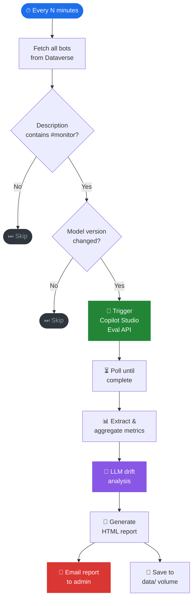
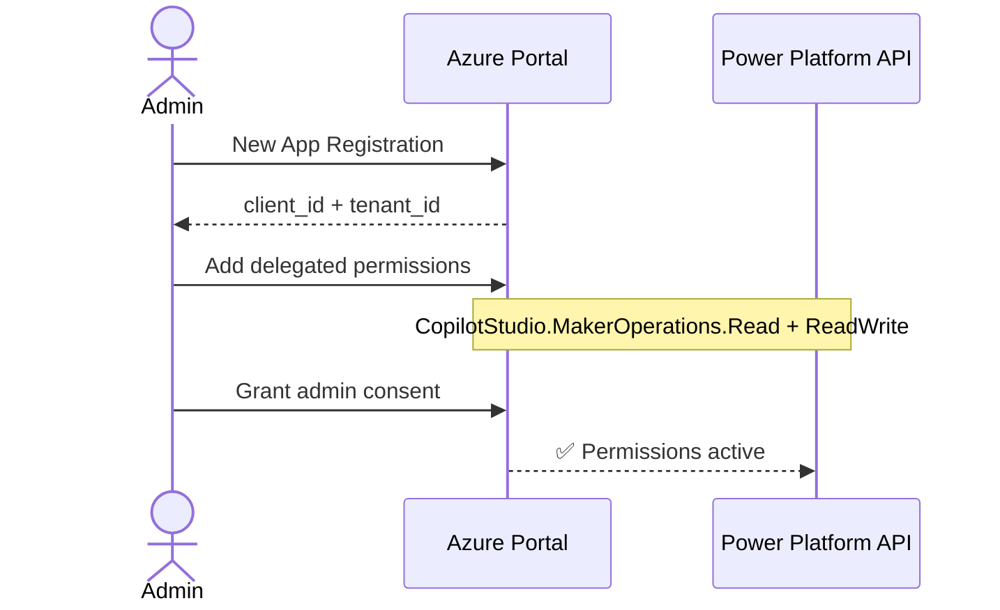
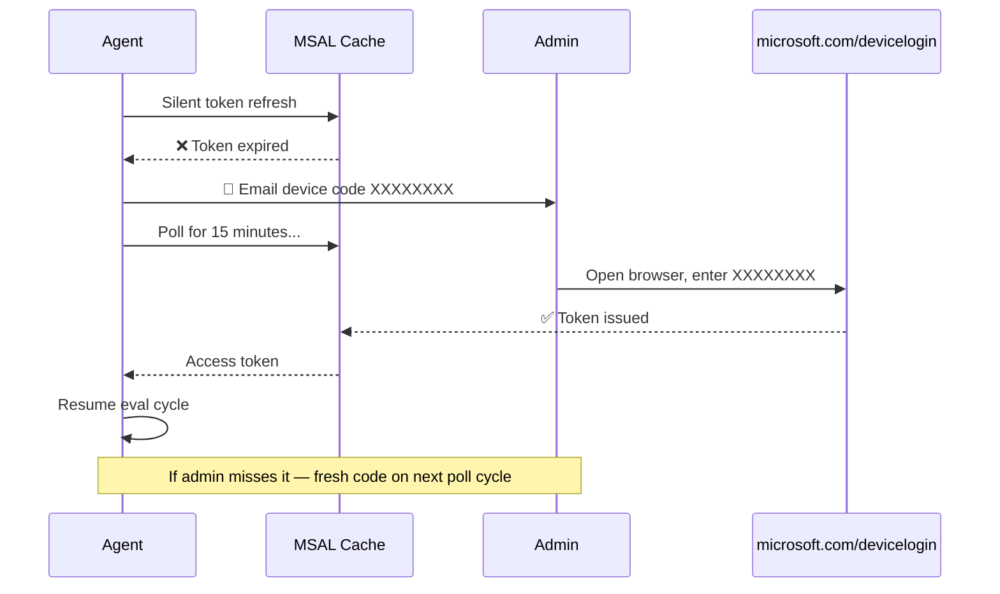

```
  ██╗     ██╗     ███╗   ███╗    ██████╗ ██████╗ ██╗███████╗████████╗
  ██║     ██║     ████╗ ████║    ██╔══██╗██╔══██╗██║██╔════╝╚══██╔══╝
  ██║     ██║     ██╔████╔██║    ██║  ██║██████╔╝██║█████╗     ██║
  ██║     ██║     ██║╚██╔╝██║    ██║  ██║██╔══██╗██║██╔══╝     ██║
  ███████╗███████╗██║ ╚═╝ ██║    ██████╔╝██║  ██║██║██║        ██║
  ╚══════╝╚══════╝╚═╝     ╚═╝    ╚═════╝ ╚═╝  ╚═╝╚═╝╚═╝        ╚═╝

  ⚡  T R A C K E R      copilot-eval-agent  ·  v1.0
```

<div align="center">


<br/>

### *Know the moment your AI changes — before your users do.*

<br/>

> **Autonomous model drift detection for Microsoft Copilot Studio bots.**
> Watches every tagged bot across all your Power Platform environments.
> Detects model version changes. Triggers evaluations. Emails you a
> side-by-side drift analysis report. Fully headless after first setup.

</div>

---

## ⚡ The Problem

Your Copilot Studio bots run on top of large language models. Microsoft updates those models silently. When they do, your bot's behaviour shifts — subtly or dramatically — with zero warning. Accuracy drops. Tone changes. Topics misfire. **You find out from a support ticket, not a dashboard.**

## 🎯 The Solution

LLM Drift Tracker watches every bot you care about, around the clock. The moment a model version change is detected in Dataverse, it fires the Copilot Studio Eval API, pulls the results, runs an LLM analysis of the metric delta, and emails you a clean side-by-side report — all before your users notice anything.

> No pass/fail verdicts · No automated rollbacks · No changes to your bots · Pure, unobtrusive observation

---

## 🔄 How it works



---

## 🏗️ Architecture

```
  ╔══════════════════════════════════════════════════════════════════════╗
  ║  🖥️  HOST  (one-time setup)                                         ║
  ║                                                                      ║
  ║   bootstrap.py ──────────────────────── writes ──► config.json      ║
  ║                └─────────────────────── caches ──► msal_token_cache ║
  ╚══════════════════════╤═══════════════════════════════════════════════╝
                         │  volume mount
                         ▼
  ╔══════════════════════════════════════════════════════════════════════╗
  ║  🐳  DOCKER  copilot-eval-agent                                     ║
  ║                                                                      ║
  ║   agent/main.py  ── poll loop ──────────────────────────────────── ►║
  ║        │                                                             ║
  ║        ├──► agent/dataverse.py  · #monitor filter ──────────────── ►║─► Dataverse
  ║        │                                                             ║   bot entity
  ║        ├──► agent/eval_client.py · trigger + poll ─────────────── ►║─► Eval API
  ║        │                                                             ║   powerplatform.com
  ║        ├──► agent/auth.py · MSAL silent refresh ──────────────── ──║─► Microsoft Identity
  ║        │                                                             ║   device code flow
  ║        ├──► agent/reasoning.py · aiResultReason clustering ──────► ║─► LLM endpoint
  ║        │                                                             ║   (any OpenAI-compat)
  ║        ├──► agent/notifier.py · on token expiry / report ready ── ►║─► SMTP → 📧 email
  ║        │                                                             ║
  ║        └──► agent/store.py ──────────────────────── writes ───────►║
  ║                                                                      ║
  ╚══════════════════════════════════════╤═════════════════════════════╤╝
                                         │                             │
                              ┌──────────▼──────────┐     ┌──────────▼──────────┐
                              │   💾  data/          │     │  📄  reports/       │
                              │   tracking.json      │     │  report_*.html      │
                              │   runs/<runId>.json  │     │  (emailed + saved)  │
                              └──────────┬──────────┘     └─────────────────────┘
                                         │ shared volume
                                         ▼
  ╔══════════════════════════════════════════════════════════════════════╗
  ║  📊  DASHBOARD  · port 8501                                         ║
  ║                                                                      ║
  ║   dashboard/app.py  ─── reads ──► data/                             ║
  ║                                                                      ║
  ║   Fleet heatmap · Radar · Trend lines · Box plots                   ║
  ║   Sankey · Failure clusters · LLM analysis panel                    ║
  ╚══════════════════════════════════════════════════════════════════════╝
```

---

## ✨ Features

| | Feature | Detail |
|---|---|---|
| 🌐 | **Multi-environment** | Watches bots across unlimited Power Platform environments |
| 🏷️ | **Opt-in via `#monitor`** | Tag a bot's Dataverse description — no config changes ever |
| 🤖 | **Zero-touch eval** | Discovers test sets, triggers + polls the Eval API automatically |
| 📊 | **Side-by-side metrics** | Pass rate delta per metric — colour-coded, no pass/fail label |
| 🧠 | **LLM reasoning** | Any OpenAI-compatible model explains the drift in plain English |
| 🔄 | **Self-healing auth** | Token expires → emails admin a device code → resumes automatically |
| 📧 | **HTML reports** | Self-contained, email-ready, archived locally |
| 🐳 | **Docker native** | Fully headless, state mounted as volumes |
| 💾 | **No cloud storage** | All state is local JSON — no Dataverse writes, no blob storage |
| 📈 | **Streamlit dashboard** | Fleet heatmap · Radar · Trends · Sankey · Failure clusters |

---

## 📁 Directory structure

```
LLMDriftTracker/
│
├── agent/                       ← 🤖 core engine (Python package)
│   ├── __init__.py
│   ├── main.py                  ← main loop — polls, orchestrates, saves reports
│   ├── auth.py                  ← dual-mode auth (az CLI locally · SP in Docker)
│   │                               self-healing eval token with email alert
│   ├── dataverse.py             ← fetches #monitor bots + model versions
│   ├── eval_client.py           ← Copilot Studio Eval REST API
│   ├── reasoning.py             ← metric aggregation + LLM drift narrative
│   ├── report.py                ← self-contained HTML report generator
│   ├── notifier.py              ← SMTP email sender (env var overrides)
│   └── store.py                 ← local JSON state per bot
│
├── dashboard/                   ← 📊 Streamlit read-only UI
│   ├── __init__.py
│   └── app.py                   ← fleet heatmap · radar · trends · analysis
│
├── bootstrap.py                 ← 🧙 one-time setup wizard (run on host, not Docker)
├── .streamlit/
│   └── config.toml              ← dark theme config
├── Dockerfile
├── .dockerignore
├── requirements.txt
│
├── config.json                  ← your config (gitignored — created by bootstrap)
├── msal_token_cache.json        ← cached auth token (gitignored — mount into Docker)
│
└── data/                        ← runtime state (gitignored — mount into Docker)
    └── <botId>/
        ├── tracking.json        last known model version + run ID
        └── runs/
            └── <runId>.json     eval result + LLM analysis
```

---

## 🚀 Full setup — A to Z

### Step 1 — Prerequisites

| What | How |
|---|---|
| Python 3.12+ | [python.org](https://python.org) |
| Docker Desktop | [docker.com](https://docker.com) |
| Azure CLI | `winget install Microsoft.AzureCLI` |
| Power Platform admin access | For app registration + admin consent |
| Copilot Studio Maker access | To tag bots and create test sets |

---

### Step 2 — App registration

The agent uses **delegated auth** — it calls the Eval API as you, not as a service. A Microsoft requirement for the Eval API.



1. [portal.azure.com](https://portal.azure.com) → **Azure Active Directory** → **App registrations** → **New registration**
2. Name: `copilot-eval-agent` · Account type: **Single tenant** → **Register**
3. Note the **Application (client) ID** and **Directory (tenant) ID**
4. **API permissions** → **Add a permission** → **APIs my organization uses** → search `Power Platform API`
5. **Delegated permissions** → tick `CopilotStudio.MakerOperations.Read` + `ReadWrite`
6. **Grant admin consent for [tenant]** → confirm

---

### Step 3 — Tag bots you want monitored

```
Copilot Studio → bot → Settings → Details → Description
```

Add `#monitor` anywhere in the description:

```
Handles HR queries for APAC employees. Routes to payroll and leave topics. #monitor
```

To stop monitoring: remove `#monitor`. Takes effect on the next poll cycle — no restarts, no config edits.

---

### Step 4 — Create test sets in Copilot Studio

> The Eval API runs against test sets you define. Without them the agent skips the bot.

```
Copilot Studio → your #monitor bot → Evaluation tab → New test set
```

Add 10–20 utterances covering the bot's main topics. The agent discovers and runs all test sets automatically.

---

### Step 5 — Run the setup wizard

```bash
git clone https://github.com/kaul-vineet/LLMDriftTracker.git
cd LLMDriftTracker
pip install -r requirements.txt
python bootstrap.py
```

```
  ╔══════════════════════════════════════════════════════════╗
  ║  ⚡  L L M   D R I F T   T R A C K E R  ⚡             ║
  ║     copilot-eval-agent  ·  v1.0  ·  Setup Wizard        ║
  ╚══════════════════════════════════════════════════════════╝

  [████████████░░░░░░░░░░░░]  50%  step 3/5

  ╔═══ ⚙️  Step 3 · Agent Settings ══════════════════════════╗
  ╚══════════════════════════════════════════════════════════╝
```

| Step | What it does |
|---|---|
| 1 · 🌐 Environments | Org URLs + environment IDs |
| 2 · 🔑 Credentials | Client ID + tenant ID |
| 3 · ⚙️ Agent settings | Poll interval + LLM endpoint |
| 4 · 🔐 Microsoft sign-in | Browser device code — one-time, token cached |
| 5 · 📧 SMTP | Mail server + test email to confirm delivery |

Outputs: `config.json` + `msal_token_cache.json`

---

### Step 6 — Test locally

```bash
python -m agent.main
```

Expected output:
```
[dataverse] Production: 2 bot(s) tagged #monitor
[agent]  HRBot: model changed unknown → gpt-4o-2024-11-20
[eval]   HRBot: run abc123 completed
[agent]  report saved → data/report_20250418T143012.html
[notifier] Report emailed to admin@contoso.com
[agent]  ── cycle complete — 1 bot(s) reported ──
```

**Force a re-evaluation** (delete prior tracking to treat current version as new):
```bash
rm data/<botId>/tracking.json
python -m agent.main
```

---

### Step 7 — Run in Docker

**Build:**
```bash
docker build -t copilot-eval-agent .
```

**Agent — local auth (dev/test):**
```bash
docker run -d \
  -v $(pwd)/data:/app/data \
  -v $(pwd)/msal_token_cache.json:/app/msal_token_cache.json \
  -v $(pwd)/config.json:/app/config.json \
  copilot-eval-agent
```

**Agent — service principal auth (production):**
```bash
docker run -d \
  -e AZURE_TENANT_ID=<tenant-id> \
  -e AZURE_CLIENT_ID=<sp-client-id> \
  -e AZURE_CLIENT_SECRET=<sp-secret> \
  -e SMTP_PASSWORD=<smtp-password> \
  -v $(pwd)/data:/app/data \
  -v $(pwd)/msal_token_cache.json:/app/msal_token_cache.json \
  -v $(pwd)/config.json:/app/config.json \
  copilot-eval-agent
```

**Dashboard:**
```bash
docker run -d -p 8501:8501 \
  -v $(pwd)/data:/app/data \
  -v $(pwd)/config.json:/app/config.json \
  --entrypoint streamlit \
  copilot-eval-agent run dashboard/app.py --server.headless true
```

Open `http://localhost:8501`

```bash
docker logs -f <container-id>
```

---

## 🔐 Token expiry — self-healing



---

## 📊 Dashboard

```
┌──────────────────────────────────────────────────────────────────┐
│  ⚡ LLM DRIFT TRACKER          ● LIVE    last scan: 2 min ago    │
├──────────────┬───────────────┬────────────────┬──────────────────┤
│  4 Bots      │  12 Eval Runs │  3 Drift Events│  Apr 18, 14:30   │
│  Monitored   │  Total        │  Detected      │  Last Activity   │
└──────────────┴───────────────┴────────────────┴──────────────────┘
```

| Visual | What it shows |
|---|---|
| 🗺️ Fleet heatmap | All bots × all model versions — composite score per cell |
| 🕸️ Radar chart | Two models overlaid — metric-by-metric shape comparison |
| 📈 Trend lines | Metric trajectory across every model version |
| 📦 Box plots | Score distribution — consistency vs variance per model |
| 🌊 Sankey diagram | Test cases flowing pass→fail or fail→pass between models |
| 📊 Failure clusters | `aiResultReason` grouped by pattern — routing · formatting · safety |
| 🧠 LLM analysis | Plain-English drift narrative per bot |

---

## 🗂️ config.json reference

```jsonc
{
  "environments": [
    {
      "name": "Production",
      "orgUrl": "https://orgXXXXX.crm.dynamics.com",
      "environmentId": "orgXXXXX"
    }
  ],

  "eval_app_client_id": "<app registration client id>",
  "eval_app_tenant_id": "<tenant id>",
  "token_cache_file":   "msal_token_cache.json",

  "store_dir":             "data",
  "poll_interval_minutes": 10,

  "llm": {
    "base_url": "http://localhost:11434/v1",   // any OpenAI-compatible endpoint
    "api_key":  "ollama",
    "model":    "llama3"
  },

  "smtp": {
    "host":      "smtp.office365.com",
    "port":      587,
    "user":      "sender@contoso.com",
    "password":  "...",
    "recipient": "admin@contoso.com"
  }
}
```

SMTP values overridable via env vars: `SMTP_HOST` `SMTP_PORT` `SMTP_USER` `SMTP_PASSWORD` `SMTP_RECIPIENT`

---

## 🔑 Auth reference

| Context | Dataverse / BAPI | Eval API |
|---|---|---|
| Local (dev) | `az account get-access-token` | MSAL device code → cached |
| Docker (prod) | `ClientSecretCredential` via env vars | Cached token, volume-mounted |

---

## 🩺 Troubleshooting

| Symptom | Fix |
|---|---|
| `0 bot(s) tagged #monitor` | Add `#monitor` to bot description — Copilot Studio → Settings → Details |
| `no test sets found` | Create a test set — Copilot Studio → bot → Evaluation tab |
| `no model changes detected` | Delete `data/<botId>/tracking.json` and re-run |
| `Dataverse token failed` | Run `az login` |
| `MSAL auth failed` | Re-run `python bootstrap.py` |
| `SMTP test failed` | Check credentials — Office 365 uses `smtp.office365.com:587` |
| Container exits immediately | Run `docker logs <id>` — likely a missing volume mount |

---

<div align="center">

```
  ✦  ·  ★   ·  ✦   ·   ★  ·   ✦  ·  ★   ·  ✦
    ★   ✦  ·   ★  ✶   ·   ✦    ★   ·   ✸  ✦
  ·  ✦   ·  ✸  ·   ✦   ★   ·  ✶   ✦  ·  ★  ·
```

Built with Python · MSAL · Copilot Studio Eval API · Dataverse Web API · Streamlit

*Tag it. Forget it. Know when things change.*

**[github.com/kaul-vineet/LLMDriftTracker](https://github.com/kaul-vineet/LLMDriftTracker)**

</div>
